# Definition：a precise and unambiguous description of a term.

一只寻找函子的猫 _2022-05-11 00:03_ _发表于北京_

Definition：a precise and unambiguous description of the meaning of a mathematical term.

  

前些日子和朋友讨论高数书及一些高中教科书出现的极值定义时，发现有不同的说法，大家觉得哪些是对的？  

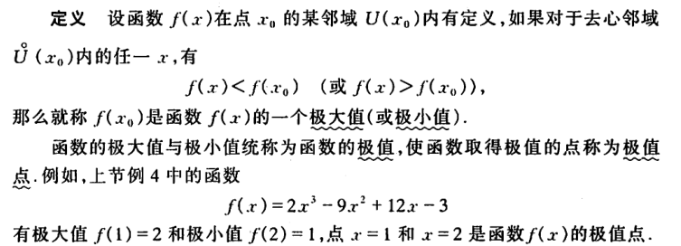

某济高数教材

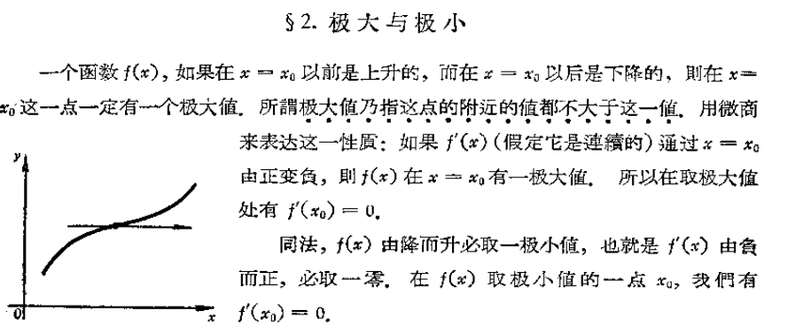

华老的《高等数学引论》

刘玉琏《数学分析讲义》

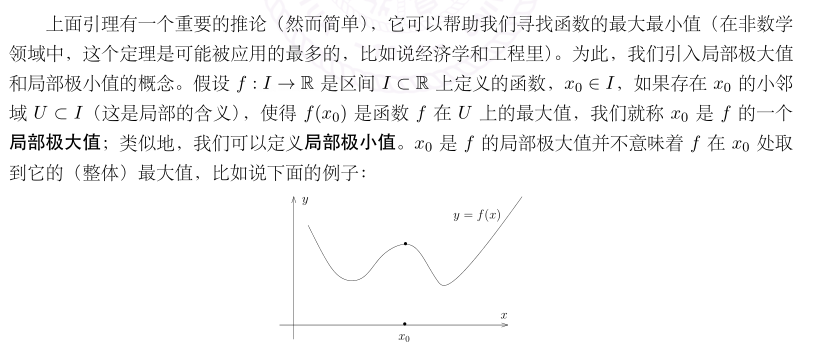

某《数学分析》讲义

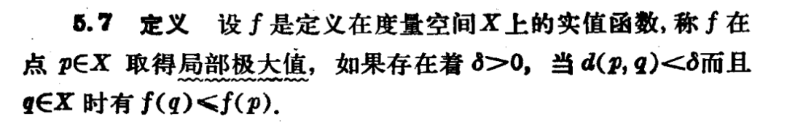

baby Rudin中文版

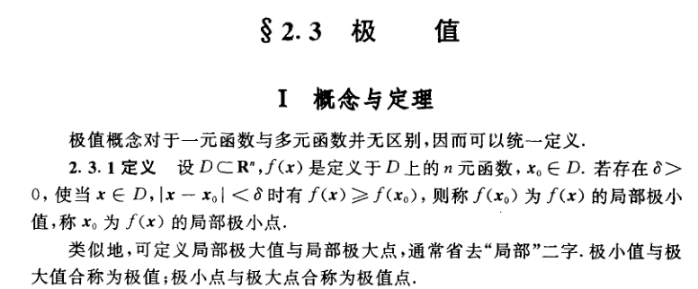

胡适耕《数学分析定理·问题·方法》

  

在上述专业材料中，分析类教材或读物的极值的定义中出现的都不是严格的不等号，只有在高数书上用了严格的不等号。  

大家的眼睛也都是雪亮的，**严格的不等号会出现一些问题**（留作思考，可在评论中留言）。  

或许高等数学和数学分析不是一个数学，所以定义不一样吧。  

  

大家都熟知，中学数学就出现了极值的概念，我们找来了现行的教材，比较一下  

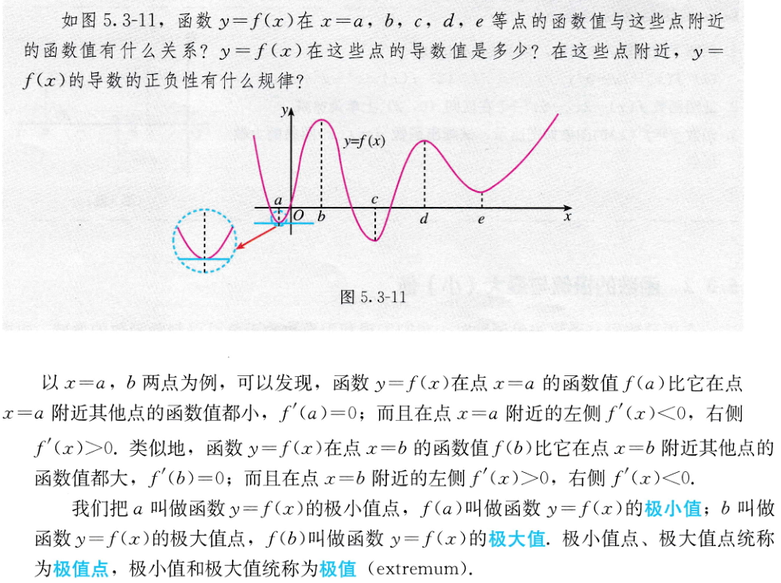

某A版教材

这里甚至没有给出严格定义，如果把这段“当作”定义，我们发现这里的极值的定义要求函数在此处可导。不可导函数y=|x|甚至没有极值了。可能这里的极值和数学分析上的极值不一样吧。  

  

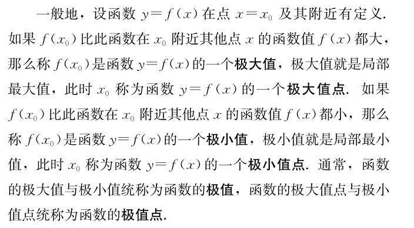

湖某版教材

隐含了严格的不等号。  

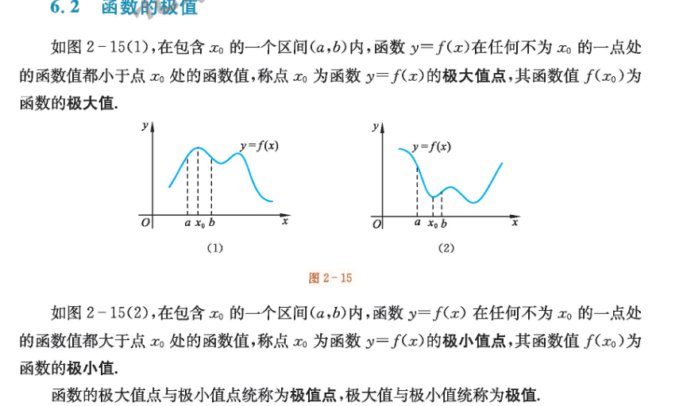

某师大版教材

严格的不等号。

  

  

  

  
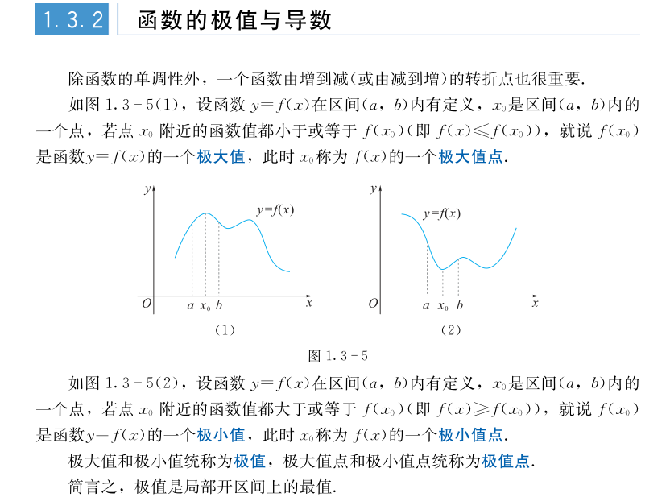

湖某版教材  

严格不等号的准确定义，点个赞。这版教材至少编者有思考过这个问题。  

  

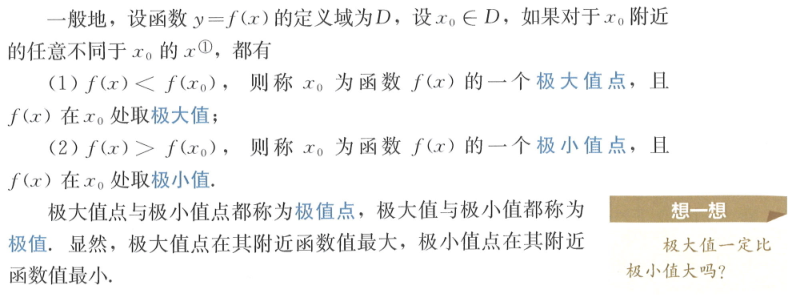
某B版教材早期

这里是严格不等号，但发现在随后修订的版本里，这里进行了修改

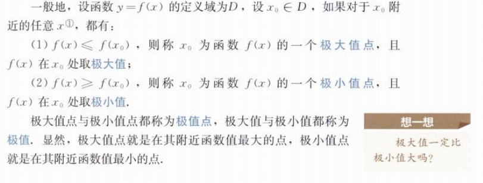
看来编者发现了问题，及时修订。

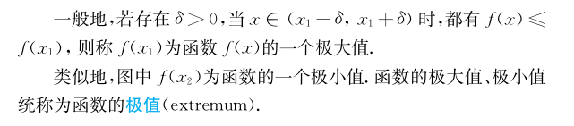
某苏版教材  

嗯嗯，很好。  

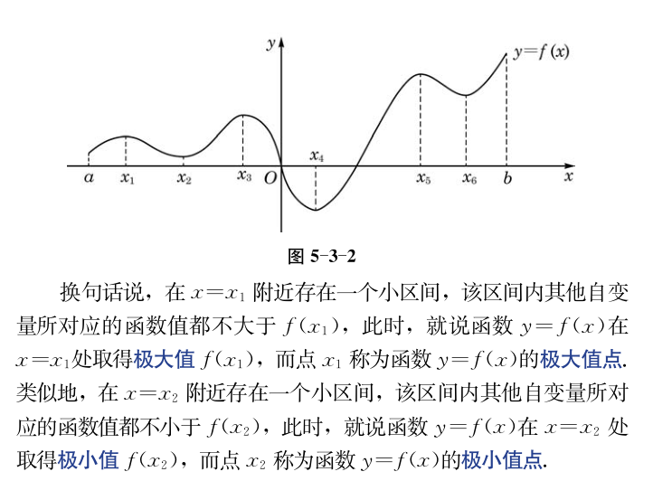
某海版教材  

隐含了带等号的不等号，定义准确。  

  

综合来看，使用量最多的某高数教材和某版教材在该定义处需要修改。特别是，函数的极值的定义应明确而正确的给出，其定义本身和函数可不可导没有关系。

  
或许上述教材都经过修订，已经修正了相关内容。请热心读者告知。

  

阅读 443

分享收藏

62

一只寻找函子的猫

29篇原创内容

关注

写下你的留言

**精选留言**

作个闲人

来自四川

赞1

这个问题不光在极大极小值时有，在定义凹凸性时也存在。中学竞赛书包括很多大学教材中涉及凹凸性和二阶导的关系以及Jensen不等式的取等条件处很多都有错。

已无更多数据